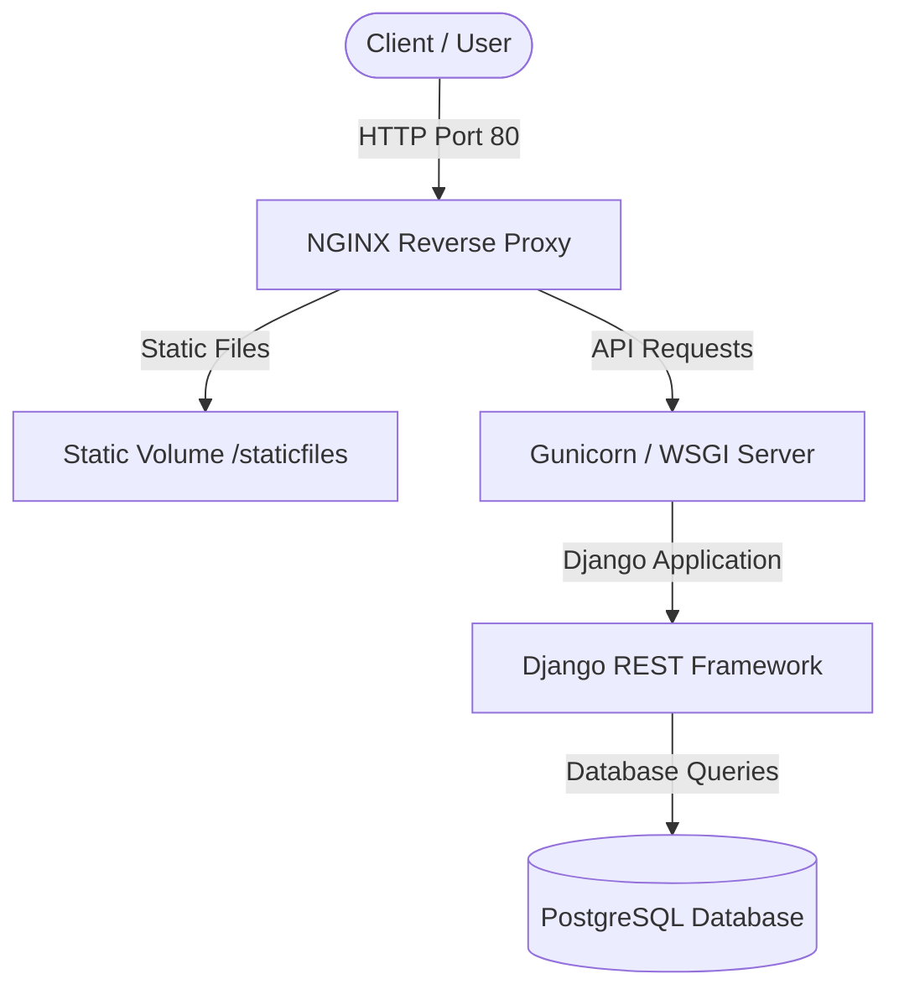

# 🛒 Django REST Framework Shopping Cart API

A high-performance, robust, and production-ready Shopping Cart RESTful API built with **Django**, **Django REST Framework (DRF)**, and **PostgreSQL**. The service is fully containerized using **Docker** and **Docker Compose**, with **NGINX** acting as a reverse proxy and static file server.

---

## 🏗️ Architecture & Data Flow

This project utilizes a multi-container microservices architecture to guarantee separation of concerns, scalability, and easy deployment:



---

## ✨ Features

- **JWT Authentication**: Secure stateless authentication using `djangorestframework-simplejwt`.
- **Product Catalog**: List and view products with titles, categories, pricing, and ratings.
- **Robust Shopping Cart System**: 
  - Dynamic adding and removing of products.
  - Multi-user isolation where each authenticated user owns a unique shopping cart.
  - Efficient quantity updates (with atomic F-expression increments to prevent race conditions).
- **Auto-Seeding with Offline Fallbacks**: During startup, the system tries to pull live product data from the `Fakestore API`. If the network is offline or the external API is down, the system gracefully seeds a set of highly detailed default products.
- **Production-Ready Configuration**: 
  - Gunicorn as the WSGI server.
  - Nginx serving static files directly and proxying application traffic.
  - PostgreSQL database storage.
  - Open API documentation via Swagger and ReDoc.

---

## 🛠️ Optimizations & Enhancements Made

We have reviewed and significantly polished the codebase to meet enterprise-level standards:

> [!NOTE]
> Here are the specific updates and bugs fixed in the latest iteration:
> 1. **Fixed Queryset Caching Bug**: In the previous version, `add` and `remove` views returned the *old* quantity in their responses due to Django queryset evaluation caching. We refactored these views to handle instance updates and query evaluation properly, guaranteeing that responses always return the accurate, updated state.
> 2. **Unified API Response Formats**: Modified the `add` and `remove` actions to consistently return the entire updated list of `CartItem`s in the user's cart, matching the structure of the `list` (GET) endpoint and making frontend state synchronization seamless.
> 3. **Graceful Error Handling (404s)**: Replaced direct database lookups (`Product.objects.get`) with safe `get_object_or_404` helper calls, preventing internal server errors (500) and returning appropriate client errors (404) for non-existent products.
> 4. **Resolved N+1 Query in Models**: Optimized the `ShoppingCart.__str__` method. The previous method queried and joined the title of every single product in the cart, causing severe performance issues. It has been replaced with a zero-query representation.
> 5. **Robust Database Seeding (`populate_db.py`)**: Wrapped database seeder HTTP requests in a try-except block with connection timeouts. If the API is unreachable, it automatically seeds 5 default fallback products, preventing container startup loops or crashes.
> 6. **Fixed Broken Serializer**: Rewrote the unused and completely broken `ShoppingCartSerializer` to map correct fields (`items` linked to `CartItemSerializer` and `user.username`) rather than non-existent model attributes.

---

## 🚀 Setup & Local Execution

### Prerequisites
Make sure you have [Docker](https://www.docker.com/) and [Docker Compose](https://docs.docker.com/compose/) installed on your machine.

### Method 1: Running with Docker Compose (Recommended)

1. Clone the repository:
   ```bash
   git clone https://github.com/faaraaad/shopping-cart.git
   cd shopping-cart
   ```

2. Build and launch the containers:
   ```bash
   docker-compose build && docker-compose up
   ```

3. Access the services:
   - **Main Web API**: `http://localhost/`
   - **Interactive Swagger Docs**: `http://localhost/swagger/`
   - **ReDoc Docs**: `http://localhost/redoc/`
   - **Django Admin Panel**: `http://localhost/admin/`

> [!IMPORTANT]
> **Default Admin Account**  
> Username: `superuser`  
> Password: `GreatPassword`

---

### Method 2: Running Locally without Docker (Development Mode)

If you wish to run the project locally without Docker, you can do so using SQLite as the database backend:

1. Create and activate a Python virtual environment:
   ```bash
   python3 -m venv venv
   source venv/bin/activate
   ```

2. Install dependencies:
   ```bash
   pip install -r requirements.txt
   ```

3. Configure environment variables for local SQLite:
   ```bash
   export SQL_ENGINE=django.db.backends.sqlite3
   export DEBUG=1
   ```

4. Apply migrations, seed the database, and run the development server:
   ```bash
   python manage.py migrate
   python manage.py shell < populate_db.py
   python manage.py runserver
   ```

5. The API is now available at `http://127.0.0.1:8000/`.

---

## 🧪 Running Tests

To execute the suite of unit and integration tests, run the following command in your terminal:

```bash
# Inside your virtual environment
SQL_ENGINE=django.db.backends.sqlite3 python manage.py test
```

---

## 📖 API Endpoints Reference

### 1. User & Authentication
All authentication-related APIs.

| Endpoint | Method | Auth Required | Description |
| :--- | :---: | :---: | :--- |
| `/api/user/create-user/` | `POST` | No | Creates a new active customer account. |
| `/api/authentication/login/` | `POST` | No | Authenticates user credentials and returns JWT `access` and `refresh` tokens. |
| `/api/authentication/refresh/` | `POST` | No | Refreshes and returns a new JWT access token. |

#### Create User Example:
```bash
curl -X POST http://localhost/api/user/create-user/ \
  -H "Content-Type: application/json" \
  -d '{"username": "customer1", "password": "securepassword123"}'
```

#### Obtain Token (Login) Example:
```bash
curl -X POST http://localhost/api/authentication/login/ \
  -H "Content-Type: application/json" \
  -d '{"username": "customer1", "password": "securepassword123"}'
```

---

### 2. Product Catalog
Retrieve products available for purchase.

| Endpoint | Method | Auth Required | Description |
| :--- | :---: | :---: | :--- |
| `/api/payment/products/` | `GET` | No | Returns a list of all products in the store catalog. |

#### Get Products Example:
```bash
curl -X GET http://localhost/api/payment/products/
```

---

### 3. Shopping Cart Management
Manage items in your shopping cart. *All endpoints in this section require a valid JWT bearer token.*

| Endpoint | Method | Auth Required | Description |
| :--- | :---: | :---: | :--- |
| `/api/payment/shopping_cart/` | `GET` | **Yes** | Retrieves all items currently in the user's shopping cart. |
| `/api/payment/shopping_cart/add/{product_id}/` | `POST` | **Yes** | Adds a product to the cart (or increments its quantity if already present). |
| `/api/payment/shopping_cart/remove/{product_id}/` | `POST` | **Yes** | Decrements the product's quantity, or removes it completely if quantity hits 0. |

#### Add Product to Cart Example:
```bash
curl -X POST http://localhost/api/payment/shopping_cart/add/1/ \
  -H "Authorization: Bearer <your_access_token_here>"
```

#### Get Current Cart Example:
```bash
curl -X GET http://localhost/api/payment/shopping_cart/ \
  -H "Authorization: Bearer <your_access_token_here>"
```

#### Remove Product from Cart Example:
```bash
curl -X POST http://localhost/api/payment/shopping_cart/remove/1/ \
  -H "Authorization: Bearer <your_access_token_here>"
```

---

## 📝 License

This project is open-source and licensed under the BSD License.
